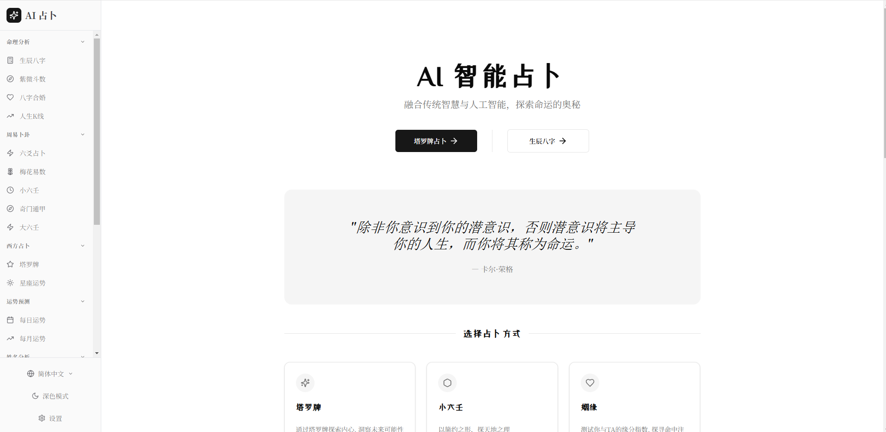

# AI 智能占卜 - AI Divination System

基于 AI 大模型的智能算命、占卜应用，支持 20+ 种占卜方式，提供流式输出体验和历史记录管理。




## 功能列表

### 核心占卜功能

| 功能 | 说明 |
|------|------|
| 🎴 **塔罗牌占卜** | 多种牌阵（单张、三张、凯尔特十字等），AI 深度解读 |
| 🔮 **紫微斗数** | 十二宫位详解，命盘排盘，大限流年分析 |
| 📅 **生辰八字** | 四柱八字排盘，五行分析，神煞推算 |
| 💑 **八字合婚** | 男女八字配对，婚姻吉凶分析 |
| 💕 **姻缘占卜** | 缘分指数测算，感情运势分析 |
| 👶 **起名取名** | 结合五行八字，AI 推荐吉祥名字 |
| 📝 **姓名五格** | 姓名笔画分析，性格命运解读 |
| 🌙 **周公解梦** | 梦境含义解析，潜意识探索 |
| 🌸 **梅花易数** | 传统易学占卜，数理推算 |
| 🎲 **六爻起卦** | 周易纳甲筮法，摇钱/数理/时空三法起卦 |
| 🔢 **小六壬** | 大安、留连、速喜等六神推算 |
| 🧙 **诸葛神算** | 三字测吉凶，神机妙算 |
| 🙏 **灵签问路** | 观音灵签、月老灵签等求签问卦 |

### 运势分析

| 功能 | 说明 |
|------|------|
| ☀️ **每日运势** | 基于八字日干的每日运势分析 |
| 📆 **每月运势** | 月度运势总览与关键日期提示 |
| ⭐ **星座运势** | 十二星座运势查询、星座配对 |
| 📈 **人生K线** | 八字运势可视化，命运起伏图表 |
| 📜 **老黄历** | 每日宜忌、吉凶方位、时辰吉凶 |

### 特色功能

- 🌊 **流式输出** - AI 占卜结果以打字机效果实时呈现
- 📚 **历史记录** - 每种占卜类型自动保存最近记录
- 📱 **响应式设计** - 完美适配手机、平板、电脑
- 🌙 **暗色模式** - 支持明暗主题切换
- 🌍 **多语言** - 支持中文/英文界面
- 🔄 **多模型故障转移** - 自动切换可用的 AI 模型
- 📤 **分享导出** - 支持复制、分享、导出图片（含二维码）

---

## 部署方式

### 方式一：Vercel 一键部署（推荐）⭐

最简单快捷的部署方式，无需服务器，完全免费。
1. 点击下方按钮开始部署：
[](https://vercel.com/new/clone?repository-url=https%3A%2F%2Fgithub.com%2Fmeuxi%2Fai-cesuan.git&env=api_key,api_base,dashscope_api_key,deepseek_api_key,enable_rate_limit,zhipu_api_key,siliconflow_api_key&project-name=my-ai-divination&repository-name=my-ai-divination)

2.在部署时配置环境变量：
api_key：必填，你的 OpenAI API Key
api_base：可选，API 地址（默认为 OpenAI 官方地址）
其他可选参数：model、github_client_id、github_client_secret 等

3.部署完成后，Vercel 会自动分配一个访问域名

4.也可以绑定自己的域名

### 方式二：Docker 部署

创建 `docker-compose.yml` 文件：

```yaml
services:
  ai-divination:
    image: ghcr.io/your-username/ai-divination:latest
    container_name: ai-divination
    restart: always
    ports:
      - 8000:8000
    environment:
      # 必填：至少配置一个 AI API
      - api_key=sk-xxx
      # - api_base=https://api.openai.com/v1
      
      # 可选：阿里云百炼
      # - dashscope_api_key=sk-xxx
      # - dashscope_model=qwen-plus
      
      # 可选：DeepSeek
      # - deepseek_api_key=sk-xxx
      
      # 可选：GitHub OAuth
      # - github_client_id=xxx
      # - github_client_secret=xxx
      # - jwt_secret=your-secret
```

启动服务：

```bash
docker-compose up -d
```

访问 `http://localhost:8000` 即可使用。

### 方式三：本地开发运行

**前置要求**：
- Node.js 18+
- Python 3.10+
- pnpm

**步骤**：

1. **克隆项目**

```bash
git clone https://github.com/your-username/ai-divination.git
cd ai-divination
```

2. **配置环境变量**

```bash
# 后端配置
cp .env.example .env
# 编辑 .env 文件，填写 API Key 等配置

# 前端配置（可选）
cp frontend/.env.example frontend/.env
```

3. **安装依赖并启动后端**

```bash
# 创建虚拟环境
python -m venv venv

# 激活虚拟环境
# Windows:
venv\Scripts\activate
# Linux/Mac:
source venv/bin/activate

# 安装依赖
pip install -r requirements.txt

# 启动后端
python main.py
```

4. **安装依赖并启动前端**（新开终端）

```bash
cd frontend
pnpm install
pnpm dev
```

5. **访问应用**
   - 前端开发服务器：`http://localhost:5173`
   - 后端 API 服务器：`http://localhost:8000`

**快捷启动脚本**（Windows）：

```bash
# 启动后端
start-backend.bat

# 启动前端
start-frontend.bat

# 或使用 PowerShell 脚本同时启动
.\dev-start.ps1
```

---

## 环境变量配置

### 必填配置

| 变量名 | 说明 | 示例 |
|--------|------|------|
| `api_key` | OpenAI API Key | `sk-xxx` |

### AI 模型配置（可选，支持多模型故障转移）

| 变量名 | 说明 | 默认值 |
|--------|------|--------|
| `api_base` | OpenAI API 地址 | `https://api.openai.com/v1` |
| `model` | OpenAI 模型 | `gpt-3.5-turbo` |
| `dashscope_api_key` | 阿里云百炼 API Key | - |
| `dashscope_model` | 百炼模型 | `qwen-plus` |
| `deepseek_api_key` | DeepSeek API Key | - |
| `deepseek_model` | DeepSeek 模型 | `deepseek-chat` |
| `zhipu_api_key` | 智谱AI API Key | - |
| `zhipu_model` | 智谱AI 模型 | `glm-4-air` |
| `siliconflow_api_key` | 硅基流动 API Key | - |
| `siliconflow_model` | 硅基流动模型 | `deepseek-ai/DeepSeek-R1-Distill-Qwen-7B` |

### 其他可选配置

| 变量名 | 说明 | 默认值 |
|--------|------|--------|
| `enable_rate_limit` | 启用频率限制 | `false` |
| `rate_limit` | 未登录用户限制 | `60,3600` (60次/小时) |
| `user_rate_limit` | 登录用户限制 | `600,3600` (600次/小时) |
| `cache_client_type` | 缓存类型 | `memory` |
| `github_client_id` | GitHub OAuth ID | - |
| `github_client_secret` | GitHub OAuth Secret | - |
| `jwt_secret` | JWT 密钥 | - |

详细配置说明请参考 `.env.example` 文件。

---

## 项目结构

```
ai-divination/
├── frontend/                 # 前端代码 (React + TypeScript + Vite)
│   ├── src/
│   │   ├── components/      # UI 组件
│   │   ├── pages/           # 页面组件
│   │   ├── hooks/           # React Hooks
│   │   ├── services/        # API 服务
│   │   ├── config/          # 配置文件
│   │   └── i18n/            # 国际化
│   └── package.json
├── src/                      # 后端代码 (Python + FastAPI)
│   ├── divination/          # 占卜算法模块
│   ├── prompts/             # AI 提示词模板
│   ├── ai/                  # AI 服务封装
│   ├── cache/               # 缓存服务
│   └── chatgpt_router.py    # API 路由
├── scripts/                  # 工具脚本
├── .env.example             # 环境变量模板
├── docker-compose.yaml      # Docker 配置
├── requirements.txt         # Python 依赖
└── vercel.json              # Vercel 配置
```

---

## 技术栈

**前端**：
- React 18 + TypeScript
- Vite
- Tailwind CSS + shadcn/ui
- React Router
- i18next (国际化)
- Zustand (状态管理)

**后端**：
- Python 3.10+
- FastAPI
- OpenAI SDK (兼容多种 AI API)
- iztro (紫微斗数)
- lunar-python (农历/八字)

**部署**：
- Vercel (推荐)
- Docker
- 任意支持 Python 的服务器

---

## 开发指南

### 添加新的占卜功能

1. **后端**：在 `src/divination/` 添加占卜算法模块
2. **前端**：在 `frontend/src/pages/divination/` 添加页面组件
3. **路由**：在 `frontend/src/App.tsx` 添加路由
4. **配置**：在 `frontend/src/config/constants.ts` 添加功能配置

### 代码规范

- 前端使用 ESLint + Prettier
- 后端使用 flake8
- 提交信息遵循 Conventional Commits

---

## 免责声明

本应用仅供娱乐参考，不构成任何决策建议。占卜结果由 AI 生成，请理性看待。

---

## License

MIT License

---

## 致谢

- [iztro](https://github.com/SylarLong/iztro) - 紫微斗数算法库
- [lunar-python](https://github.com/6tail/lunar-python) - 农历/八字算法库
- [shadcn/ui](https://ui.shadcn.com/) - UI 组件库
- [react-iztro](https://github.com/SylarLong/react-iztro) - 紫微斗数命盘样式参考
